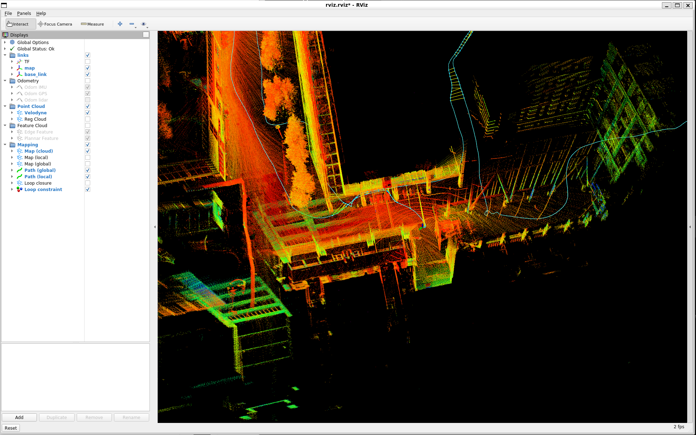
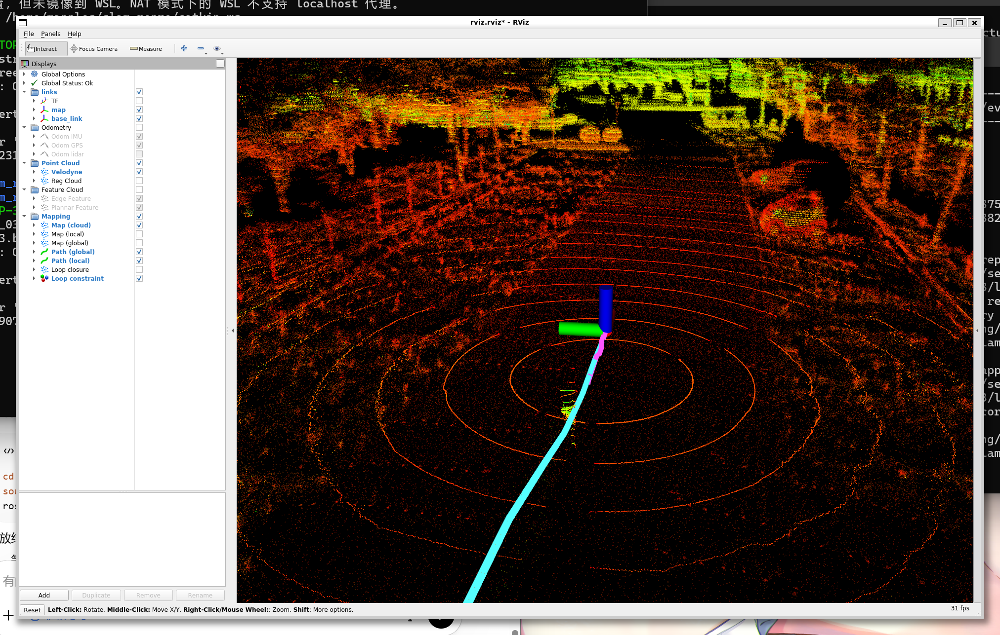
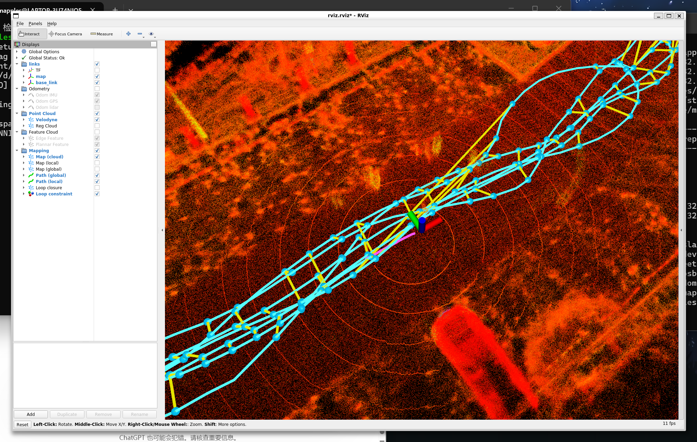
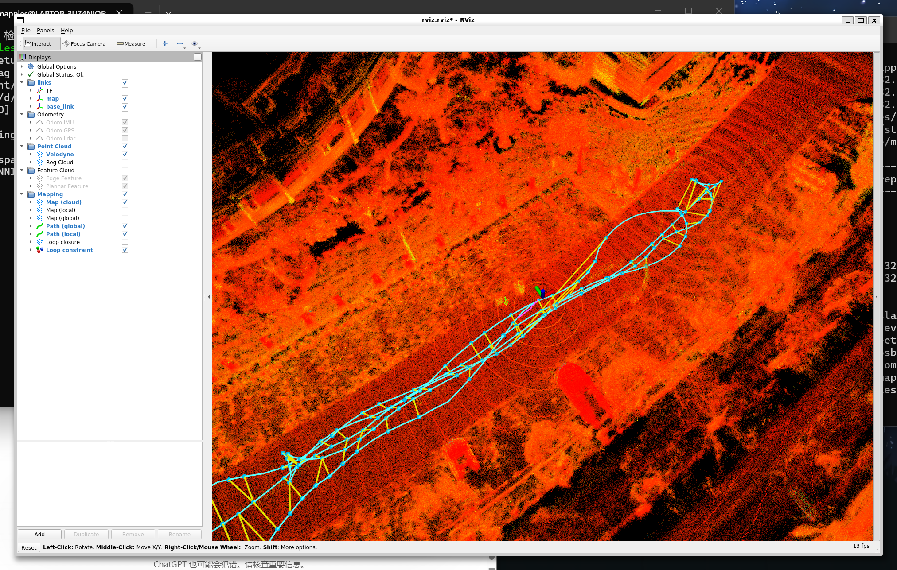

# SLAM Paper Reproduction Notes

## 项目目标

复现论文《Sensor Fusion SLAM: An Efficient and Robust SLAM system for Dynamic Environments》，按照“先建立正式评测流程，再逐步复现论文核心改动”的路线推进。

当前优先复现的是 LIO（LiDAR-Inertial Odometry，激光雷达-惯性里程计）侧改动，再逐步进入特征提取、动态点处理和其他模块。

---

## 当前阶段

当前已经完成：

- Ubuntu 20.04 + ROS Noetic 环境搭建
- `catkin` 工作空间创建
- `LIO-SAM` 编译通过并跑通
- 明确 `walking_dataset.bag` 只能作为跑通检查集，不能作为正式精度评测集
- 正式评测数据切换到 `M2DGR / room_dark_01`
- 完成 `room_dark_01` 的 GT 预处理与 TUM 格式转换
- 完成 `room_dark_01` 上的正式 baseline 评测
- 完成论文中自适应残差系数 `k` 的第一步复现
- 完成 adaptive `k` 与 baseline 的 APE 对比评测
- 已定位 `featureExtraction.cpp` 中曲率与特征提取的关键函数，作为下一阶段入口
- 所有关键结果已提交并推送到 GitHub

---

## 正式评测数据

当前正式评测使用：

- `room_dark_01.bag`
- `room_dark_01.txt`

数据存放在 Windows D 盘，通过 WSL 挂载访问：

- `/mnt/d/slam_datasets/m2dgr/room_dark_01`

说明：

- 大体积原始数据不进 Git
- Git 仓库只保存配置、轨迹、评测结果和说明文档

---

## 当前正式 baseline 结果

评测序列：`room_dark_01`

### GT

- GT poses: 5621
- duration: about 115.12 s
- path length: about 38.03 m

### LIO-SAM baseline

- estimated poses: 555
- matched pairs: 547
- APE mean: `0.136145 m`
- APE rmse: `0.148386 m`
- APE max: `0.284917 m`

评测参数：

- `--align`
- `--t_max_diff 0.05`

---

## 自适应 k 复现结果

当前已完成论文中 LIO 残差自适应系数 `k` 的第一步复现：

- 修改文件：`catkin_ws/src/LIO-SAM/src/mapOptmization.cpp`
- 修改位置：`surfOptimization()`
- 改动内容：将固定残差系数 `0.9` 改为随点到雷达距离变化的自适应 `k`

### Adaptive k 结果

- estimated poses: 555
- matched pairs: 547
- APE mean: `0.134612 m`
- APE rmse: `0.146603 m`
- APE max: `0.281849 m`

### 与 baseline 对比

- matched pairs: `547 -> 547`
- mean: `0.136145 -> 0.134612`
- rmse: `0.148386 -> 0.146603`
- max: `0.284917 -> 0.281849`

结论：

- 自适应 `k` 在 `room_dark_01` 上带来了小幅但稳定的精度提升
- 系统运行链路保持正常，没有破坏 baseline 的可用性

---

## 当前关键文件

### 仓库根目录

- `/home/mapples/slam_repro`

### catkin 工作空间

- `/home/mapples/slam_repro/catkin_ws`

### LIO-SAM 源码目录

- `/home/mapples/slam_repro/catkin_ws/src/LIO-SAM`

### baseline 参数快照

- `notes/config_snapshots/params_room_dark_01_handsfree.yaml`

### 正式评测目录

- `eval/formal/room_dark_01`

其中包括：

GT：
- `eval/formal/room_dark_01/gt/room_dark_01_gt_raw.txt`
- `eval/formal/room_dark_01/gt/room_dark_01_gt_tum.txt`

baseline：
- `eval/formal/room_dark_01/traj/room_dark_01_lio_baseline.tum`
- `eval/formal/room_dark_01/logs/room_dark_01_ape_baseline.txt`
- `eval/formal/room_dark_01/logs/room_dark_01_ape_baseline.zip`
- `eval/formal/room_dark_01/meta/room_dark_01_baseline_summary.md`

adaptive k：
- `eval/formal/room_dark_01/traj/room_dark_01_lio_adaptive_k.tum`
- `eval/formal/room_dark_01/logs/room_dark_01_ape_adaptive_k.txt`
- `eval/formal/room_dark_01/logs/room_dark_01_ape_adaptive_k.zip`
- `eval/formal/room_dark_01/meta/room_dark_01_adaptive_k_summary.md`

---

## 当前源码定位结论

目前已经完成两块核心源码定位：

### 1. LIO 残差优化

文件：

- `catkin_ws/src/LIO-SAM/src/mapOptmization.cpp`

已完成：

- `surfOptimization()` 中自适应 `k` 的第一步复现

### 2. 特征提取

文件：

- `catkin_ws/src/LIO-SAM/src/featureExtraction.cpp`

已定位关键函数：

- `calculateSmoothness()`
- `markOccludedPoints()`
- `extractFeatures()`

当前结论：

- baseline 曲率定义在 `calculateSmoothness()`
- 角点 / 面点筛选主逻辑在 `extractFeatures()`
- 下一步论文复现很可能从这里继续推进

---

## 当前 Git 状态

GitHub 仓库：

- `https://github.com/Mapples-Frost/slam-paper-reproduction`

当前工作分支：

- `stage4-baseline-eval`

最近关键提交：

- `33bff3b` — `feat(lio): add adaptive k for surf residual weighting`
- `468f27a` — `eval(room_dark_01): record adaptive k results`

---

## 下一步计划

下一步不再重复搭环境，也不再重复 baseline。

下一阶段重点：

1. 继续分析 `featureExtraction.cpp`
2. 对照论文定位“曲率 / 特征提取”改法
3. 做最小改动复现
4. 重新运行 `room_dark_01`
5. 继续使用相同 GT 和 APE 流程做改前改后对比
6. 每个阶段完成后及时 `git add / commit / push`

---

## 说明

本仓库主要记录：

- 复现过程
- 参数快照
- 轨迹结果
- 评测结果
- 阶段性总结

默认不上传：

- 大体积原始数据
- 编译产物
- 第三方源码大文件
- 运行输出 bag

---

## 结果总览

### room_dark_01

在 `room_dark_01` 上，当前已经完成以下对比：

- baseline
- adaptive `k`
- adaptive `k` + feature refactor
- adaptive `k` + feature refactor + dynamic v3

关键结论：

- `adaptive k` 是当前最清晰、最稳定的正向改动
- 相比 baseline，`adaptive k` 在 `mean`、`rmse`、`max` 上都有小幅改善
- `feature refactor` 可以稳定运行，但没有明显优于 `adaptive k`
- `dynamic v3` 已成功接入并可运行，但在该室内静态序列上没有体现出明显额外收益

`room_dark_01` 关键结果：

- baseline: `mean 0.136145`, `rmse 0.148386`, `max 0.284917`
- adaptive `k`: `mean 0.134612`, `rmse 0.146603`, `max 0.281849`
- `k + feature refactor`: `mean 0.134606`, `rmse 0.146834`, `max 0.288260`
- `k + feature refactor + dynamic v3`: `mean 0.134596`, `rmse 0.146802`, `max 0.290208`

详细总结见：

- `eval/formal/room_dark_01/meta/room_dark_01_overall_summary.md`

### street_03

在 `street_03` 上，当前已经完成以下对比：

- baseline
- current combo (`adaptive k + feature refactor + dynamic v3`)

关键结论：

- `street_03 baseline` 成功跑通，可作为室外参考结果
- 当前组合版在 `street_03` 上明显退化，说明这一整套组合改动尚未在室外场景中体现出鲁棒收益

`street_03` 关键结果：

- baseline: `mean 0.129208`, `rmse 0.139533`, `max 0.422916`
- current combo: `mean 0.163851`, `rmse 0.205268`, `max 0.698998`

详细总结见：

- `eval/formal/street_03/meta/street_03_overall_summary.md`

### 当前阶段总结

截至目前，可以得到较稳妥的结论：

- 室内静态场景中，`adaptive k` 是当前最有效的单项改动
- `feature refactor` 与 `dynamic v3` 已完成系统接入和运行验证
- 但在现有实现下，这两部分尚未在 `room_dark_01` 和 `street_03` 上表现出明确、稳定的额外收益
- 尤其在 `street_03` 这种室外序列中，当前组合版相对 baseline 仍然存在明显退化

---

## 运行截图

### room_dark_01

### street_01

### street_02

### street_03

